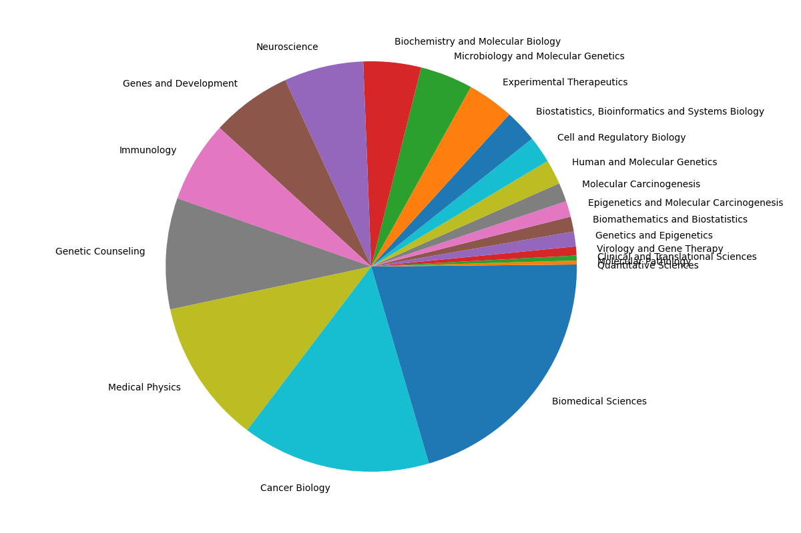
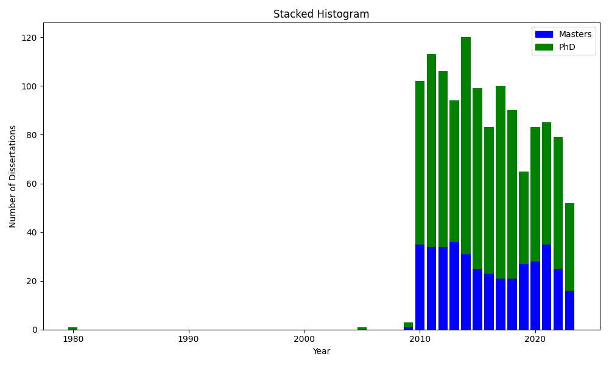
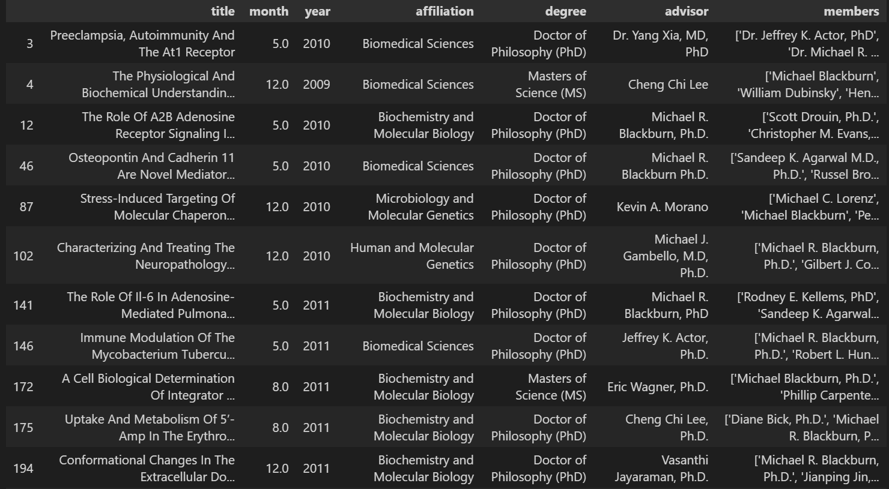
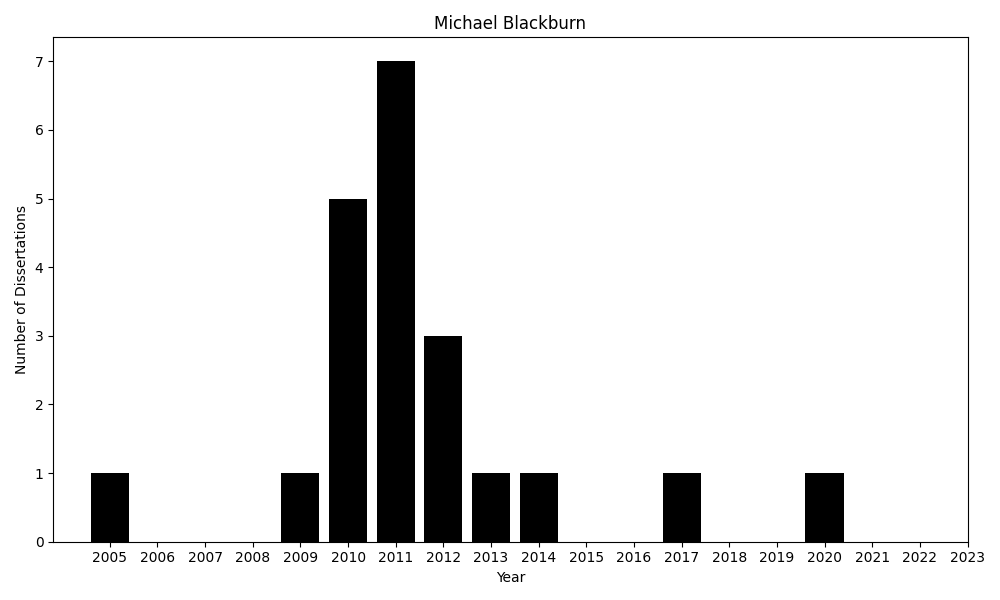

# Dissertation Parser

---

This code parses the dissertations from [this link](https://digitalcommons.library.tmc.edu/utgsbs_dissertations/) for the UT GSBS graduate school. Note, although dissertations have been given since around 1979, only 2009 and afterwards are in online format. Technically, you can get the 1979-1999 dissertations in print format. Not sure about the 1999-2009 dissertations?

Although it's not perfect due to typos and errors in the HTML, this should be accurate to around 98% based on rough estimates of my attempts to match similarily spelled versions of the same name (i.e., `Michael Blackburn` vs. `Michael Blackburn Ph.D.` vs. `Dr. Michael Blackburn` etc.).

There's a lot more analysis to be done, but I figured this would be a good resource for any newer student who wishes to find committee members and check their history and whether or not they have recently been on a committee.

---

### Distribution of dissertation program affiliations

### Stacked histogram of number of each type of degree by year

### Sample DataFrame and distribution of Michael Blackburn

